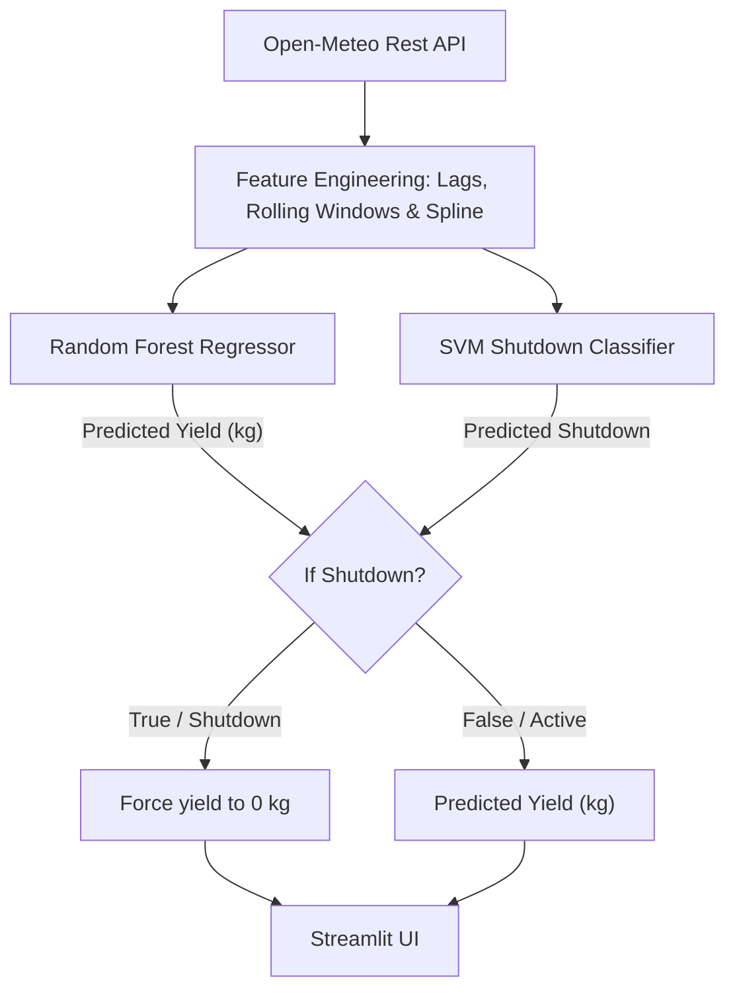

# ⚡ Green Hydrogen Yield & Power Grid Forecasting Platform

**A real time Machine Learning forecasting pipeline that predicts 7 day Green Hydrogen production yield ($kg$) and detects critical electrolyzer shutdown conditions using dynamic weather physics and hybrid ML inference.**

[Streamlit App](https://green-h2-forecast.streamlit.app)
[Hugging Face](https://huggingface.co/Adarsh-0704/green-h2-forecast)

---

## 💡 The Problem

Green Hydrogen electrolyzers require a stable minimum power input derived from wind speed and GHI to operate safely. When incoming renewable power drops below critical operational thresholds (40% of the electrolyzer's max output), continuing to run the plant risks severe hardware degradation, gas-mixing and catalyst damage requiring an immediate shutdown.
Standard regression and even Random Forest models perform poorly near these boundary conditions. They often predict small positive hydrogen yields during periods when the electrolyzer is actually forced to be offline ($0 \text { kg}$).
This platform resolves these edge case prediction errors using a hybrid architecture. An upstream Support Vector Machine safety classifier detects shutdown states and enforces real world physical $0 \text{ kg}$ constraints before outputting predictions from a Random Forest Regressor.

---

## 🧠 Machine Learning Architecture




### 1. Data Foundation & Feature Engineering
* **Training Data:** 11 years (2014–2024) of historical hourly climate data from the **NASA POWER API**.
* **Test Data:** Full unseen 2025 climate data.
* **Feature Engineering:**
    * **Wind Power Non-linearity:** Since wind power varies with $v^3$, standard linear assumptions were expanded using polynomial and spline terms to capture it.
  * **1-Hour Weather Lags:** Tracks sudden changes in GHI and Windspeed.
  * **3-Hour Rolling Averages & Standard Deviation:** Is calculated to capture wind turbulence and to track short-term grid stability.
  * **Cyclical Hour Splines:** Captures solar radiation (GHI) in hourly day and night cycles

### 2. The Machine Learning Pipeline and Hybrid Model
* **Random Forest Regressor:** Handles continuous yield modeling during active operating of electrolyzer.
* **SVM Safety Classifier:** Since regressors struggle to output 0 kg a dedicated SVM classifies whether operating conditions fall below the safety threshold. 
* **Logic Override:** Uses numpy's `np.where` to check the SVM decision state. If a shutdown is flagged, the final yield array forces to be 0 kg otherwise retains the original predicted Random Forest yield.

---

## 🛠️ Stack & Infrastructure

* **Frontend & Dashboard:** Streamlit 1.60, Plotly Express, Pandas, NumPy
* **Machine Learning:** Scikit-Learn 1.8.0, SciPy 1.17.1, Joblib
* **Model Hosting:** Model weights decoupled to **Hugging Face Hub** (`Adarsh-0704/green-h2-forecast`) to keep the core repository clean.
* **Data Pipelines:** Open-Meteo Forecast API, NASA POWER Historical API
* **Package Management & Deployment:** Streamlit Cloud

---

## 📁 Repository Structure


```text
green-h2-yield/
│
├── .devcontainer/              
│   └── devcontainer.json
│
├── notebooks/                  
│   ├── 01_data_exploration.ipynb
│   ├── 02_feature_engineering.ipynb
│   ├── 03_hydrogen_yield.ipynb
│   ├── 04_testing.ipynb
│   └── 05_svm_classification.ipynb
│
├── scripts/                    
│   ├── live_forecast.py        
│   ├── pipeline.py             
│   ├── train.py                
│   └── train_classification.py 
│
├── .gitignore                  
├── README.md                   
├── app.py                      
└── requirements.txt  
```          

## Quick Start
```bash
# Clone the repo
git clone https://github.com/Adarsh-0704/green-h2-yield.git
cd green-h2-yield

# Set up a virtual env
python -m venv .venv
source .venv/bin/activate # For Windows .venv\Scripts\activate

# Install dependencies
pip install -r requirements.txt 

# Run the Streamlit app
streamlit run app.py
```